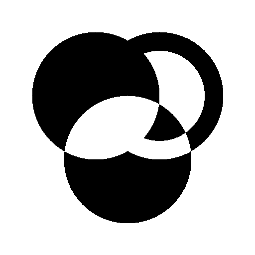

# Circle renderer
Simple CPU circles renderer written in C

It uses only unsigned integer math.
It outputs image to image.pbm.
Resolution and other options can be changed in main.c.

Example:


I wrote first version in 2-3 hours.

## BUILD

	make
## RUN
	./main

If you want to convert pbm to png,
you can do

	pamtopng image.pbm > image.png

```pamtopng``` is from Netpbm tool
